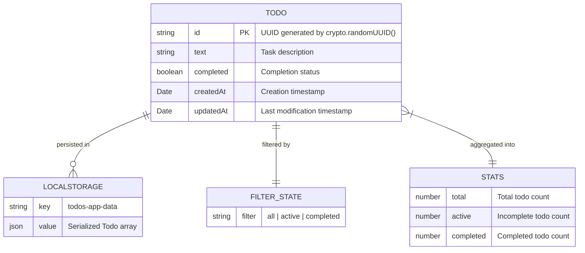
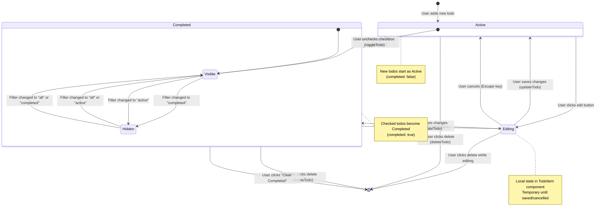
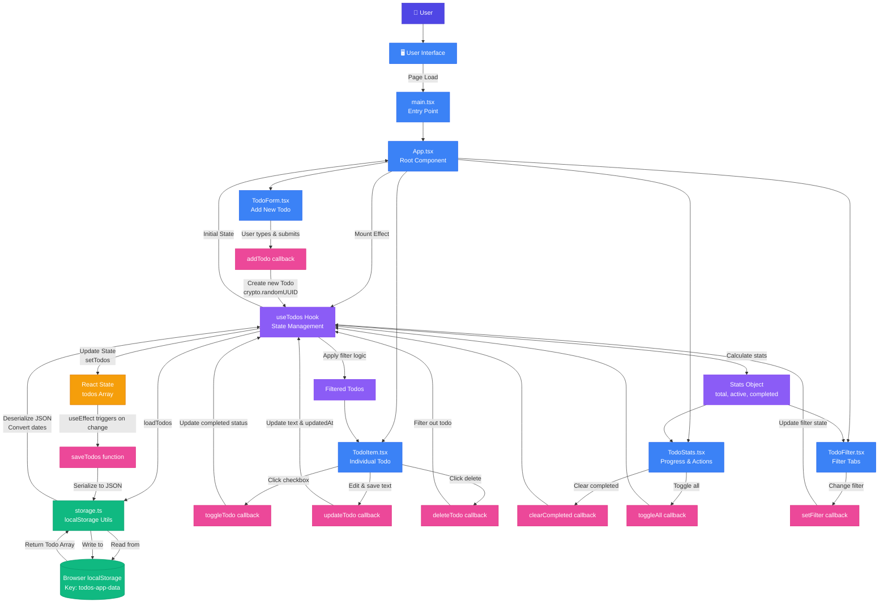
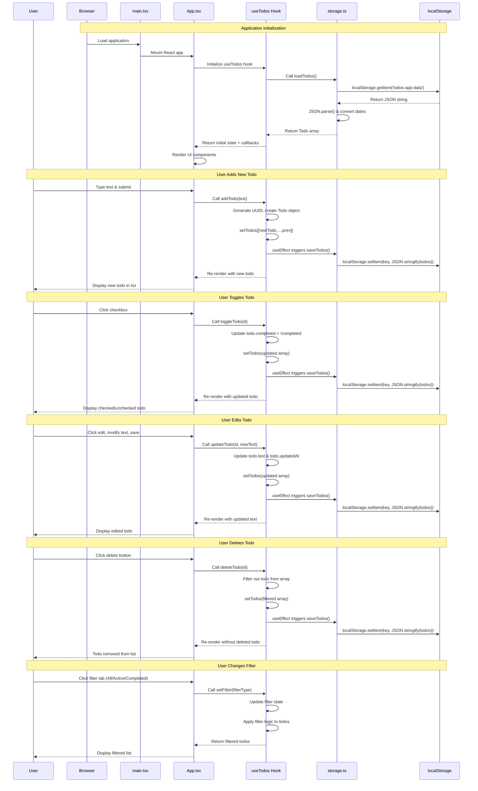

# TodoFlow - Architecture Diagrams

This document contains comprehensive diagrams illustrating the TodoFlow application architecture, data models, state flows, and data flows.

---

## 1. Entity Relationship Diagram

This diagram shows the data model and entity structure.



---

## 2. State Flow Diagram

This diagram shows how todo items transition between different states.



---

## 3. Complete End-to-End Data Flow



---

## 4. Complete Application Lifecycle

This sequence diagram shows the complete lifecycle from app initialization to user interactions.



---

## Legend

- **Purple (User)**: User interaction layer
- **Blue (Components)**: React components and UI elements
- **Violet (Hooks)**: State management and business logic
- **Green (Storage)**: Persistence layer (localStorage)
- **Orange (State)**: React state container
- **Pink (Callbacks)**: Action handlers and functions

## Key Data Flow Patterns

### 1. Initial Load (App Startup)
```
Browser → main.tsx → App.tsx → useTodos (mount effect) →
storage.loadTodos() → localStorage → Parse & Deserialize →
Initial State → Render Components
```

### 2. Add New Todo
```
User Input → TodoForm → addTodo() → useTodos (create Todo with UUID) →
React setState → Auto-save effect → storage.saveTodos() → localStorage
```

### 3. Toggle/Edit/Delete Todo
```
User Action → TodoItem → callback (toggle/update/delete) →
useTodos (modify state) → React setState → Auto-save effect →
storage.saveTodos() → localStorage
```

### 4. Filter Todos
```
User Click → TodoFilter → setFilter() → useTodos (update filter state) →
Apply filter logic → Return filtered todos → Re-render TodoItem list
```

### 5. Automatic Persistence
```
Any State Change → React useEffect (line 14-16 in useTodos.ts) →
storage.saveTodos() → JSON.stringify() → localStorage.setItem()
```

## Important Notes

- **No Backend**: All data stays in the browser's localStorage
- **Automatic Saves**: Every state change triggers an automatic save (useEffect dependency on `todos`)
- **Single Source of Truth**: The `useTodos` hook is the only place that manages state
- **Unidirectional Flow**: Data flows down via props, actions flow up via callbacks
- **Presentational Components**: All components are "dumb" - they receive props and call callbacks
