# TodoFlow - Architecture Diagrams

This document contains comprehensive diagrams illustrating the TodoFlow application architecture, data models, state flows, and data flows.

---

## 1. Entity Relationship Diagram

This diagram shows the data model and entity structure.


---

## 2. State Flow Diagram

This diagram shows how todo items transition between different states.


---

## 3. Complete End-to-End Data Flow

```mermaid
graph TD
    %% User Interactions
    User[👤 User] --> UI[🖥️ User Interface]

    %% Initial Load
    UI -->|Page Load| Main[main.tsx<br/>Entry Point]
    Main --> App[App.tsx<br/>Root Component]
    App -->|Mount Effect| UseTodos[useTodos Hook<br/>State Management]
    UseTodos -->|loadTodos| Storage[storage.ts<br/>localStorage Utils]
    Storage -->|Read from| LocalStorage[(Browser localStorage<br/>Key: todos-app-data)]
    LocalStorage -->|Return Todo Array| Storage
    Storage -->|Deserialize JSON<br/>Convert dates| UseTodos
    UseTodos -->|Initial State| App

    %% Component Tree
    App --> TodoForm[TodoForm.tsx<br/>Add New Todo]
    App --> TodoFilter[TodoFilter.tsx<br/>Filter Tabs]
    App --> TodoStats[TodoStats.tsx<br/>Progress & Actions]
    App --> TodoItem[TodoItem.tsx<br/>Individual Todo]

    %% Add Todo Flow
    TodoForm -->|User types & submits| AddTodo[addTodo callback]
    AddTodo -->|Create new Todo<br/>crypto.randomUUID| UseTodos
    UseTodos -->|Update State<br/>setTodos| ReactState[React State<br/>todos Array]

    %% Toggle Todo Flow
    TodoItem -->|Click checkbox| ToggleTodo[toggleTodo callback]
    ToggleTodo -->|Update completed status| UseTodos

    %% Edit Todo Flow
    TodoItem -->|Edit & save text| UpdateTodo[updateTodo callback]
    UpdateTodo -->|Update text & updatedAt| UseTodos

    %% Delete Todo Flow
    TodoItem -->|Click delete| DeleteTodo[deleteTodo callback]
    DeleteTodo -->|Filter out todo| UseTodos

    %% Bulk Actions
    TodoStats -->|Clear completed| ClearCompleted[clearCompleted callback]
    TodoStats -->|Toggle all| ToggleAll[toggleAll callback]
    ClearCompleted --> UseTodos
    ToggleAll --> UseTodos

    %% Filter Flow
    TodoFilter -->|Change filter| SetFilter[setFilter callback]
    SetFilter -->|Update filter state| UseTodos
    UseTodos -->|Apply filter logic| FilteredTodos[Filtered Todos]
    FilteredTodos --> TodoItem

    %% Auto-Save Effect
    ReactState -->|useEffect triggers on change| SaveTodos[saveTodos function]
    SaveTodos -->|Serialize to JSON| Storage
    Storage -->|Write to| LocalStorage

    %% Stats Calculation
    UseTodos -->|Calculate stats| Stats[Stats Object<br/>total, active, completed]
    Stats --> TodoFilter
    Stats --> TodoStats

    %% Styling
    classDef userClass fill:#4F46E5,stroke:#4338CA,color:#fff
    classDef componentClass fill:#3B82F6,stroke:#2563EB,color:#fff
    classDef hookClass fill:#8B5CF6,stroke:#7C3AED,color:#fff
    classDef storageClass fill:#10B981,stroke:#059669,color:#fff
    classDef stateClass fill:#F59E0B,stroke:#D97706,color:#fff
    classDef callbackClass fill:#EC4899,stroke:#DB2777,color:#fff

    class User userClass
    class UI,App,TodoForm,TodoFilter,TodoStats,TodoItem,Main componentClass
    class UseTodos,FilteredTodos,Stats hookClass
    class Storage,LocalStorage storageClass
    class ReactState stateClass
    class AddTodo,ToggleTodo,UpdateTodo,DeleteTodo,ClearCompleted,ToggleAll,SetFilter,SaveTodos callbackClass
```



---

## 4. Complete Application Lifecycle

This sequence diagram shows the complete lifecycle from app initialization to user interactions.


---

## Legend

- **Purple (User)**: User interaction layer
- **Blue (Components)**: React components and UI elements
- **Violet (Hooks)**: State management and business logic
- **Green (Storage)**: Persistence layer (localStorage)
- **Orange (State)**: React state container
- **Pink (Callbacks)**: Action handlers and functions

## Key Data Flow Patterns

### 1. Initial Load (App Startup)
```
Browser → main.tsx → App.tsx → useTodos (mount effect) →
storage.loadTodos() → localStorage → Parse & Deserialize →
Initial State → Render Components
```

### 2. Add New Todo
```
User Input → TodoForm → addTodo() → useTodos (create Todo with UUID) →
React setState → Auto-save effect → storage.saveTodos() → localStorage
```

### 3. Toggle/Edit/Delete Todo
```
User Action → TodoItem → callback (toggle/update/delete) →
useTodos (modify state) → React setState → Auto-save effect →
storage.saveTodos() → localStorage
```

### 4. Filter Todos
```
User Click → TodoFilter → setFilter() → useTodos (update filter state) →
Apply filter logic → Return filtered todos → Re-render TodoItem list
```

### 5. Automatic Persistence
```
Any State Change → React useEffect (line 14-16 in useTodos.ts) →
storage.saveTodos() → JSON.stringify() → localStorage.setItem()
```

## Important Notes

- **No Backend**: All data stays in the browser's localStorage
- **Automatic Saves**: Every state change triggers an automatic save (useEffect dependency on `todos`)
- **Single Source of Truth**: The `useTodos` hook is the only place that manages state
- **Unidirectional Flow**: Data flows down via props, actions flow up via callbacks
- **Presentational Components**: All components are "dumb" - they receive props and call callbacks
